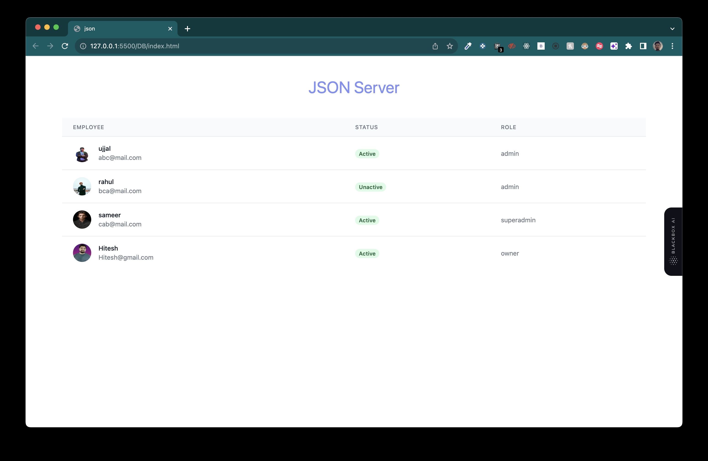

# API Project

The project aims to demonstrate how to make API calls to a JSON-server using only HTML, Tailwind CSS, and JavaScript. I have a simple web application that fetches data from the JSON-server and displays it on the webpage.

## this is how it looks



## Technologies Used:
1. HTML: For structuring the webpage elements.
2. Tailwind CSS: For styling the user interface with minimal CSS code.
3. JavaScript: For making API calls and handling the data.

Steps to Create the Project:

Step 1: Set Up JSON-Server
- Install JSON-server using npm (Node Package Manager) or yarn globally on your system.
- Create a JSON file (e.g., "data.json") with some sample data. For example:
```json
 { 
            "id":"1",
            "name":"ujjal",
            "email":"abc@mail.com",
            "profile":"../ujjalmoni_clipdrop-relight.png",
            "status":"Active",
            "role":"admin"

        },
        { 
            "id":"2",
            "name":"rahul",
            "email":"bca@mail.com",
            "profile":"https://images.unsplash.com/photo-1521119989659-a83eee488004?ixlib=rb-4.0.3&ixid=M3wxMjA3fDB8MHxzZWFyY2h8NXx8cG9ydHJhaXR8ZW58MHx8MHx8fDA%3D&auto=format&fit=crop&w=800&q=60",
            "status":"Unactive",
            "role":"admin"
        },
        { 
            "id":"3",
            "name":"sameer",
            "email":"cab@mail.com",
            "profile":"https://images.unsplash.com/photo-1506794778202-cad84cf45f1d?ixlib=rb-4.0.3&ixid=M3wxMjA3fDB8MHxzZWFyY2h8M3x8cG9ydHJhaXR8ZW58MHx8MHx8fDA%3D&auto=format&fit=crop&w=800&q=60",
            "status":"Active",
            "role":"superadmin"
        },
        {
            "id":"4",
            "name":"Hitesh",
            "email":"Hitesh@gmail.com",
            "role":"owner",
            "profile":"https://hiteshchoudhary.com/static/a8d73d1aac4c79e9bb689640e6090367/2eaab/person-image.jpg",
            "status":"Active"
        }
```
- Start the JSON-server using the command:
```
json-server --watch data.json
```
- The JSON-server will be accessible at "http://localhost:3000".

Step 2: Create the HTML Structure
Create an "index.html" file and set up the basic structure of the webpage. Include a div to display the fetched data from the API.

```html
<!DOCTYPE html>
<html lang="en">
<head>
    <meta charset="UTF-8">
    <meta name="viewport" content="width=device-width, initial-scale=1.0">
    <title>json</title>
    <script src="https://cdn.tailwindcss.com"></script>
</head>
<body>
    <div class="container mx-auto">
        <h1 class="text-center text-4xl text-indigo-400 py-12">JSON Server</h1>
        <table class="min-w-full divide-y divide-gray-200">
            <thead class="bg-gray-50">
                <tr>
                    <th class="px-6 py-3 text-left text-xs font-medium text-gray-500 uppercase  tracking-wider">Employee</th>
                    <th class="px-6 py-3 text-left text-xs font-medium text-gray-500 uppercase  tracking-wider">Status</th>
                    <th class="px-6 py-3 text-left text-xs font-medium text-gray-500 uppercase  tracking-wider">Role</th>
                </tr>
            </thead>
            <tbody class="bg-white divide-y divide-gray-200" id="tbody">
            </tbody>
        </table>
    </div>


    <script src="./index.js"></script>
</body>
</html>
```

Step 3: Fetch Data from JSON-Server using JavaScript
Create a JavaScript file (e.g., "index.js") and include it in the "index.html" file.

```html
<!-- Add this script tag after the closing </body> tag -->
<script src="script.js"></script>
```

Inside "script.js", add the following JavaScript code to fetch data from the JSON-server and display it on the webpage.

```js

let tbody = document.getElementById("tbody")


// fetch function
fetch("http://localhost:3000/user")
    .then(res => res.json())
    .then(json => {
        json.map(data => {
            console.log(data)
            tbody.append(td_fun(data));
        })
    })

// create td
function td_fun({ profile, name, email, status, role}){
    let td = document.createElement('tr');
    td.innerHTML = `
    <td class="px-6 py-4 whitespace-nowrap">
        <div class="flex items-center">
                <div class="flex-shrink-0 h-10 w-10">
                    
                </div>
                <div class="ml-4">
                    <div class="text-sm font-medium text-gray-900">
                        ${name}
                    </div>
                    <div class="text-sm text-gray-500">
                        ${email}
                    </div>
                </div>
            </div>
    </td>
    <td class="px-6 py-4 whitespace-nowrap">
        <span class="px-2 inline-flex text-xs leading-5 font-semibold rounded-full bg-green-100 text-green-800">
           ${status}
        </span>
    </td>
    <td class="px-6 py-4 whitespace-nowrap">
        <span class="text-sm text-gray-500">${role}</span>
    </td>
    `;
    return td;
}
```

Step 4: Add Tailwind CSS
Include the Tailwind CSS link in the head section of "index.html" from the official CDN.

```html
<!-- Add this link tag inside the <head> section -->
<script src="https://cdn.tailwindcss.com"></script>
```

Step 5: Run the Application
Open the "index.html" file in your web browser, and you should see a list of users fetched from the JSON-server displayed on the webpage.

That's it! You've successfully created a project that makes API calls to a JSON-server using HTML, Tailwind CSS, and JavaScript.
